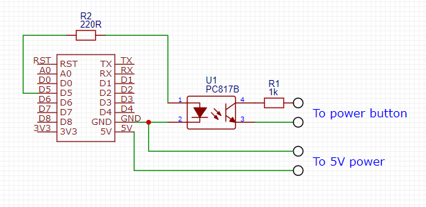
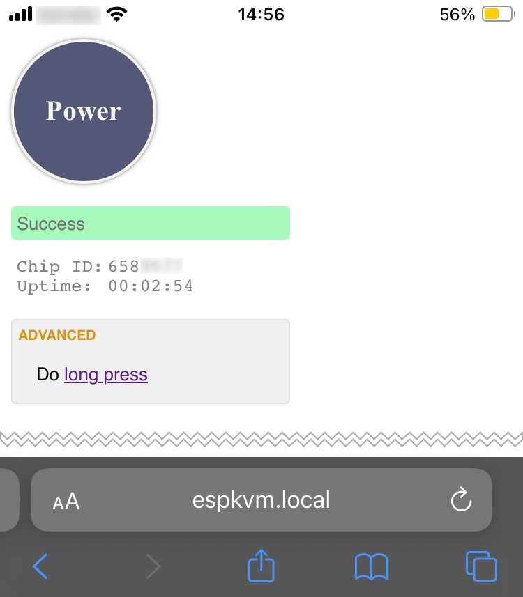

# ESP power button - Remote home server power-button

What's the problem being solved. I have a home server. When I'm not at home I need a possibility to switch the server on. The server is just a powerful desktop PC, in fact, not a specialized server hardware (where the Problem would probably be natively solved). WOL (Wake-on-LAN) is not 100% reliable, in particular because of periodic electricity outages - the network card should be properly set into the WOL mode. If there were a small IoT device, which would be always online, that could press the power button ...

This is my version of such a remote power button, based on ESP8266 micro-controller, with Web UI and http REST endpoints.

P.S. I intentionally ignore the (good!) option with a wifi smart power socket and "power on after power loss" BIOS configuration. It would be simpler and faster, but it's boring and no fun and does not give an opportunity to learn new technologies ;)

## Features

- Board: Wemos D1 mini (esp8266)
- Web UI address in local nework (mDNS): http://espkvm.local
- Press button API endpoint: `espkvm.local/power` (POST request, e.g. `curl -X POST http://espkvm.local/power`)
- Long press button: `espkvm.local/power?push=long` (POST request)
- Quick health state and uptime `espkvm.local/hz`
- Powered by USB or 5V (e.g. unused USB pins on motherboard)

## Schematics

## Configuration

- build and upload with Arduino IDE
- specify `WIFI_SSID` and `WIFI_PASS` in `secrets.h`
- potentially change the `HOSTNAME` in the main file
- comment `DEBUG` to remove Serial trace and use D5 pin for pressing (should be connected to optocoupler), otherwise integrated LED is used instead.

## Mikrotik script

There is one practical problem. The mDNS requests are possible locally, where you probably can probably physically push the button. When connecting remotely mDNS is not available by default, you must know the IP address. There are many options to solve this issue, starting from a mere fixed IP address. One of the options is a script at your router that would find the connected ESP among the DHCP leases by its hostname and send the POST request to it. 

If you're a happy (or unhappy) user of a Mikrotic router, you can find a sample script in [espkvm-push-power.rsc](./espkvm-push-power.rsc) file. Install it to the router and call via the UI or Terminal (`/system script run espkvm-push-power`). Mind the hostname if you change it.

## Images

The board  

The (sorry for the mess) installation  

UI sample  

